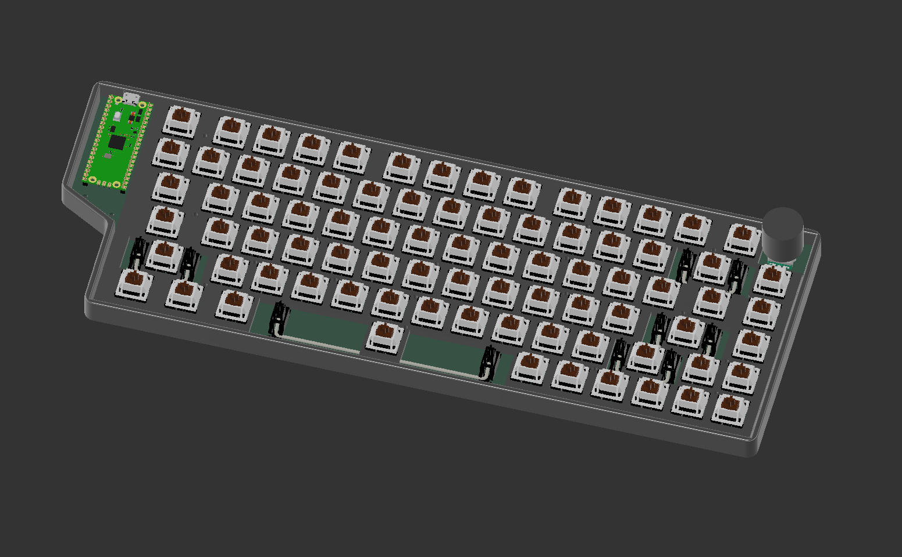
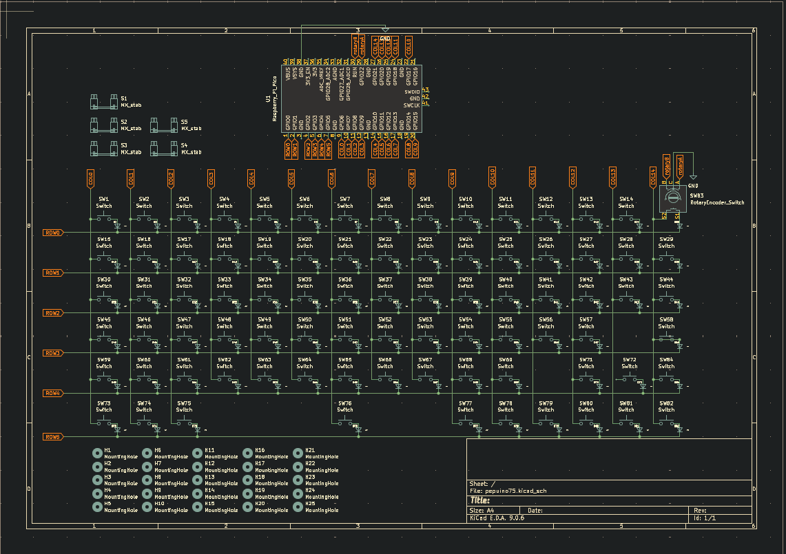
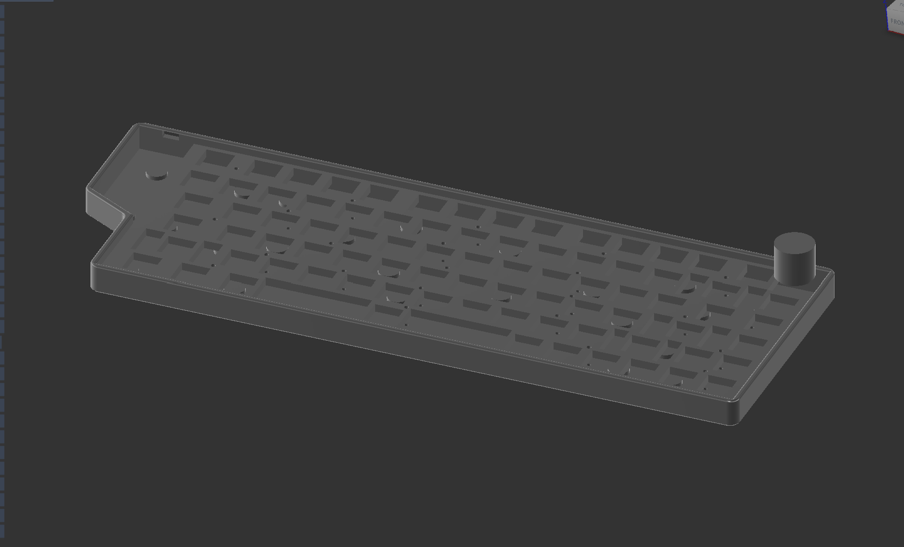

## Introducing the pepuino75

This is the pepuino75, a 75 percent keyboard, featuring my custom microcontroler, the pepuinoNanoV1 (https://github.com/pipejosh/pepuinoNano-devBoard), this keyboard also features a rotary encoder, design to make it as compact as possible, without lossing any of its features!

### RENDER
 
### SCHEMATIC
 
### PCB
 
### CASE
 

### BOM
 

## KIT Components

| Item | Description | Quantity | Unit Price | Total Price | URL |
|---|---|---:|---:|---:|---|
| Keycaps Set | Keycaps for the keyboard | 126 | 0.07 | 8.31 | https://www.aliexpress.com/item/1005007321700850.html |
| Switches | Mechanical switches | 90 | 0.20 | 18.11 | https://www.aliexpress.com/item/1005009787231480.html |
| Diodes | SMD diodes | 100 | 0.03 | 3.15 | https://www.aliexpress.com/item/1005007160563285.html |
| USB-C Cable | USB-C cable | 1 | 3.31 | 3.31 | https://www.aliexpress.com/item/1005005080440661.html |
| M2 Standoff | M2 standoff 5 mm | 50 | 0.05 | 2.50 | https://www.aliexpress.com/item/1005006049595637.html |
| M2 Screw | M2 screw 5 mm | 50 | 0.03 | 1.60 | https://www.aliexpress.com/item/1005005070119421.html |
| Stabilizers | MX stabilizers (6.25u & 2u) | 5 | 0.73 | 3.64 | https://www.aliexpress.com/item/1005007212869086.html |
| Taxes | AliExpress tax | — | — | 4.28 | — |

**KIT Components Subtotal:** 44.90

---

## PCB Costs

| Item | Description | Cost |
|---|---|---:|
| JLCPCB | Pepuino75 PCB | 26.47 |
| JLCPCB Shipping | PCB shipping + taxes | 21.58 |

**PCB Subtotal:** 48.05

---

## GRAND TOTAL

| Category | Amount |
|---|---:|
| KIT Components | 44.90 |
| PCB | 48.05 |
| **TOTAL** | **92.95** |

